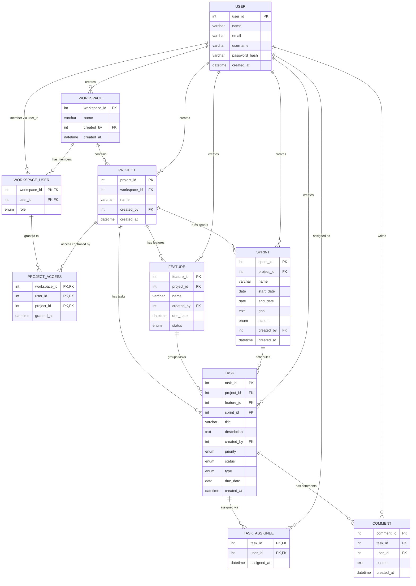

# Team Collaboration App — ER Diagram Documentation

Reference documentation for the data model: the diagram, every entity and its
attributes, the relationships with cardinalities, and notes on the design choices
(junction tables, the backlog state, the `project_id` decision, and the JPA mappings).

---

## 1. The diagram



---

## 2. Entities

### USER
The account of a person in the system.

| Column | Type | Key | Notes |
|---|---|---|---|
| user_id | INT | PK | auto-increment |
| name | VARCHAR(100) | | display name |
| email | VARCHAR(255) | | unique |
| username | VARCHAR(50) | | unique |
| password_hash | VARCHAR(255) | | never store plaintext |
| created_at | DATETIME | | |

### WORKSPACE
Top-level container that holds projects; owned by the user who created it.

| Column | Type | Key | Notes |
|---|---|---|---|
| workspace_id | INT | PK | |
| name | VARCHAR(100) | | |
| created_by | INT | FK → USER | owner |
| created_at | DATETIME | | |

### WORKSPACE_USER  *(junction)*
Resolves the many-to-many between users and workspaces, and stores the member's role.

| Column | Type | Key | Notes |
|---|---|---|---|
| workspace_id | INT | PK, FK → WORKSPACE | |
| user_id | INT | PK, FK → USER | |
| role | ENUM | | e.g. admin / member / viewer |

### PROJECT
A project belonging to one workspace.

| Column | Type | Key | Notes |
|---|---|---|---|
| project_id | INT | PK | |
| workspace_id | INT | FK → WORKSPACE | parent workspace |
| name | VARCHAR(100) | | |
| created_by | INT | FK → USER | |
| created_at | DATETIME | | |

### PROJECT_ACCESS  *(junction)*
Per-user access grants to a specific project within a workspace.

| Column | Type | Key | Notes |
|---|---|---|---|
| workspace_id | INT | PK, FK → WORKSPACE | |
| user_id | INT | PK, FK → USER | |
| project_id | INT | PK, FK → PROJECT | |
| granted_at | DATETIME | | |

### FEATURE
A feature/epic that groups related tasks within a project.

| Column | Type | Key | Notes |
|---|---|---|---|
| feature_id | INT | PK | |
| project_id | INT | FK → PROJECT | |
| name | VARCHAR(150) | | |
| created_by | INT | FK → USER | |
| due_date | DATETIME | | nullable |
| status | ENUM | | e.g. planned / in_progress / done |

### SPRINT
A time-boxed iteration within a project.

| Column | Type | Key | Notes |
|---|---|---|---|
| sprint_id | INT | PK | |
| project_id | INT | FK → PROJECT | |
| name | VARCHAR(100) | | |
| start_date | DATE | | nullable |
| end_date | DATE | | nullable |
| goal | TEXT | | nullable |
| status | ENUM | | e.g. planned / active / completed |
| created_by | INT | FK → USER | |
| created_at | DATETIME | | |

### TASK
The unit of work. A task with `sprint_id IS NULL` is in the **backlog**.

| Column | Type | Key | Notes |
|---|---|---|---|
| task_id | INT | PK | |
| project_id | INT | FK → PROJECT | direct link (see §4.3) |
| feature_id | INT | FK → FEATURE | nullable |
| sprint_id | INT | FK → SPRINT | nullable → backlog when null |
| title | VARCHAR(255) | | |
| description | TEXT | | nullable |
| created_by | INT | FK → USER | |
| priority | ENUM | | e.g. low / medium / high / critical |
| status | ENUM | | e.g. todo / in_progress / in_review / done |
| type | ENUM | | classification: story / bug / task / epic |
| due_date | DATE | | nullable |
| created_at | DATETIME | | |

### TASK_ASSIGNEE  *(junction)*
Resolves the many-to-many between tasks and the users assigned to them.

| Column | Type | Key | Notes |
|---|---|---|---|
| task_id | INT | PK, FK → TASK | |
| user_id | INT | PK, FK → USER | |
| assigned_at | DATETIME | | |

### COMMENT
A comment written by a user on a task.

| Column | Type | Key | Notes |
|---|---|---|---|
| comment_id | INT | PK | |
| task_id | INT | FK → TASK | |
| user_id | INT | FK → USER | author |
| content | TEXT | | |
| created_at | DATETIME | | |

---

## 3. Relationships

| From | To | Cardinality | Meaning |
|---|---|---|---|
| USER | WORKSPACE | 1 : N | a user creates many workspaces |
| USER ↔ WORKSPACE | WORKSPACE_USER | M : N | membership, carries `role` |
| WORKSPACE | PROJECT | 1 : N | a workspace contains many projects |
| USER | PROJECT | 1 : N | creator |
| WORKSPACE_USER / PROJECT ↔ USER | PROJECT_ACCESS | M : N | per-user project access |
| PROJECT | FEATURE | 1 : N | a project has many features |
| PROJECT | SPRINT | 1 : N | a project runs many sprints |
| PROJECT | TASK | 1 : N | direct ownership of tasks |
| FEATURE | TASK | 1 : N | a feature groups many tasks |
| SPRINT | TASK | 1 : N | a sprint schedules many tasks |
| USER | TASK | 1 : N | creator |
| TASK ↔ USER | TASK_ASSIGNEE | M : N | task assignment |
| TASK | COMMENT | 1 : N | a task has many comments |
| USER | COMMENT | 1 : N | author |

All `created_by` columns are 1 : N references back to USER.

---

## 4. Design notes

### 4.1 Backlog is a state, not an entity
There is no `BACKLOG` table. A backlog task is simply a task with `sprint_id IS NULL`.

```sql
SELECT * FROM task WHERE project_id = ? AND sprint_id IS NULL;
```

Pulling into a sprint = `UPDATE task SET sprint_id = ? WHERE task_id IN (...)`.
Sending back = `SET sprint_id = NULL`. A separate backlog table would carry no
attributes of its own (a 1:1 with project) and would create a second source of
truth, so the state-based model is preferred.

### 4.2 Many-to-many → junction tables
`WORKSPACE_USER`, `TASK_ASSIGNEE`, and `PROJECT_ACCESS` exist because their pairs are
many-to-many. Each row is one relationship; the composite of the foreign keys is the
primary key. Junctions also hold relationship-specific data (`role`, `assigned_at`,
`granted_at`) that belongs to neither parent alone.

### 4.3 Direct `project_id` on TASK (deliberate redundancy)
`TASK.project_id` duplicates what is reachable via `feature.project_id` and
`sprint.project_id`. It was added on purpose so the backlog query is a simple indexed
lookup with no joins, and so a task with neither feature nor sprint still knows its
project. **Tradeoff:** the database does not enforce that the three agree, so the
service layer must validate that a task's `project_id` matches its feature's and
sprint's project before saving.

### 4.4 `type` as ENUM
`TASK.type` classifies a task (story / bug / task / epic) — a fixed, small,
single-value set, which is the textbook case for `ENUM`. (Multi-value "labels" would
instead need a `TASK_LABEL` junction table.) If users ever define custom types or each
type needs metadata, promote it to a `TASK_TYPE` lookup table with a FK.
