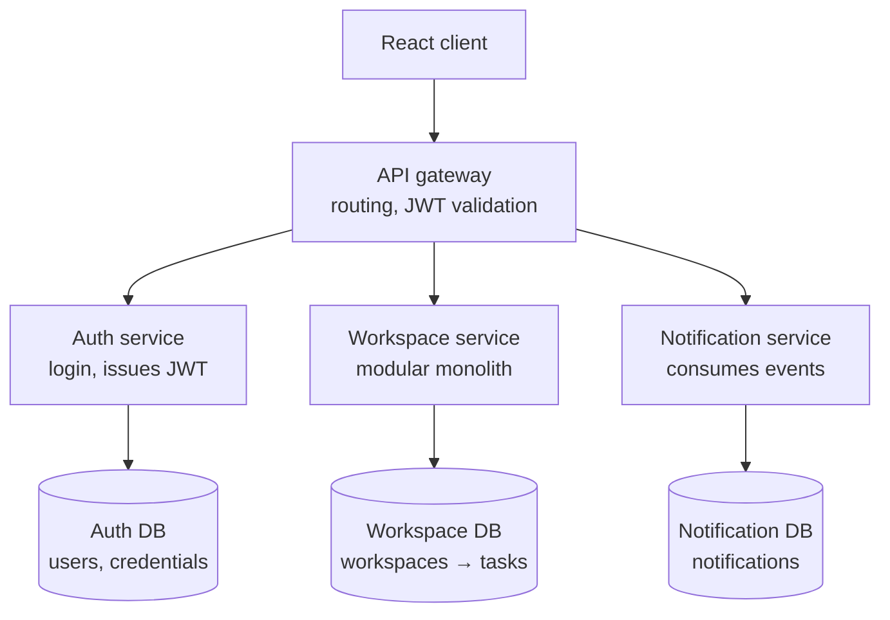
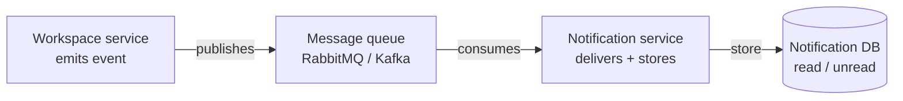

# Team Collaboration App — Microservices Architecture

Architecture design and the justification for each decision, written the way you'd
defend it in an interview or viva.

---

## 1. Overview

Three services, split along bounded contexts, each owning its own database:

| Service | Responsibility | Data it owns |
|---|---|---|
| **Auth service** | Login, registration, issuing & signing JWTs | users, credentials |
| **Workspace service** | Core domain — workspaces, projects, features, sprints, tasks, comments | everything except users |
| **Notification service** | Delivering and storing notifications | notifications (read/unread) |

- **Client → services**: synchronous REST, through an API gateway.
- **Workspace → Notification**: asynchronous events, through a message queue.
- **Auth**: issues JWTs; every other service validates them *locally* by signature.

> The workspace service is itself a **modular monolith** — project, sprint, task,
> feature, and comment are modules *inside one deployable*, not separate services.

---

## 2. Topology (synchronous request path)

## 3. Asynchronous notification flow

Example event: `task.assigned` is published when a task gets an assignee. The
workspace service does **not** wait for delivery — it fires the event and returns.

---

## 4. Design decisions & interview justifications

### 4.1 Why exactly these three services?
**Decision:** Split along bounded contexts — auth, workspace (core domain), notification.
**Why:** A good boundary is drawn where the *business capability* changes, not where
the code happens to sit. These three change for different reasons and at different
rates: auth when security needs change, workspace when product features change,
notification when delivery channels change.
**Defense:** *"Three reasons to change → three services."*

### 4.2 Why is auth its own service?
**Decision:** Isolate authentication completely.
**Why:** Auth is cross-cutting — every service depends on it; it depends on none.
Isolating it keeps security-sensitive code (password hashing, token signing) in one
auditable place, and makes it reusable across products.
**Defense:** *"Auth is a dependency of everything and a dependent of nothing, so it sits
at the bottom of the stack as its own service."*

### 4.3 Why is workspace a modular monolith, not three more microservices?
**Decision:** Keep project / sprint / task / feature / comment as modules in one service.
**Why:** They are *tightly coupled* — the ER diagram is full of foreign keys between
them and the backlog query joins across them. Splitting them turns in-database joins
into cross-network calls and risks distributed transactions for a single
"create task in sprint" operation. For a 3-person team on a deadline, that buys
nothing. A modular monolith gives clean internal boundaries without the distributed
tax, and a module can be extracted later if a seam proves itself.
**Defense:** *"Microservice boundaries should follow low-coupling seams. These modules
are tightly coupled, so splitting them would create a distributed monolith — the worst
of both worlds."*

### 4.4 Why database-per-service, not one shared database?
**Decision:** Each service owns a private database; others reach it only via its API.
**Why:** A shared database couples services through its schema — one team's migration
can break another service. Private databases let services deploy and scale
independently.
**Tradeoff (name it proactively):** you lose cross-service SQL joins and FK
enforcement across boundaries.
**Defense:** *"The database is a private implementation detail of each service."*

### 4.5 The data-ownership consequence (the one most candidates miss)
**Decision:** `USER` lives in the **auth** database; everything else in workspace.
**Why it matters:** In the single ER diagram, `USER` is a real table with foreign keys
everywhere (`created_by`, assignees, comment authors). Once auth is split out, those
become **logical references**, not enforced FKs — the workspace DB stores a bare
`user_id` with no constraint to a USER table it can't see. To show a name, workspace
either calls the auth service or caches a lightweight user projection (`user_id`, `name`).
**Defense:** *"Splitting auth out turns my USER foreign keys into cross-service
references, so I drop the FK constraint and resolve users via the auth API."*

### 4.6 Why JWT and stateless auth?
**Decision:** Auth signs a JWT; every service validates it locally by signature.
**Why:** No per-request database lookup and no call back to auth — so any instance of
any service can validate any request independently. That's what makes the system
horizontally scalable.
**Nuance:** use **asymmetric signing** — auth holds the private key, services hold the
public key. Only auth can mint tokens; everyone can verify them, with no shared secret
that could forge tokens.
**Defense:** *"Stateless validation means I can add server instances freely behind a
load balancer — no sticky sessions, no shared session store."*

### 4.7 Why sync REST for the client but async events for notifications?
**Decision:** Synchronous where the user waits on the result; asynchronous where work
can happen out-of-band.
**Why:** Assigning a task shouldn't block on an email being sent. The workspace service
fires an event and returns. Benefits: **resilience** (if notification is down, task
creation still succeeds and the queue buffers events) and **decoupling** (workspace
doesn't know who consumes the event).
**Defense:** *"Notifications are out-of-band work, so they go through a queue, not the
request path."*

### 4.8 Why an API gateway?
**Decision:** Single entry point for the client.
**Why:** The client doesn't need to know the service topology or juggle multiple base
URLs; routing, JWT validation, and CORS are centralized.
**Honest caveat:** for a 3-person project a gateway is *recommended, not mandatory* —
you can ship without one and add it when the service count grows.
**Defense:** Being able to separate essential from nice-to-have under a deadline is
itself a signal of good judgment.

---

## 5. The one principle that ties it together

> **Split where coupling is low and reasons-to-change differ.
> Keep together where coupling is high.
> Go async wherever the user isn't waiting.**

