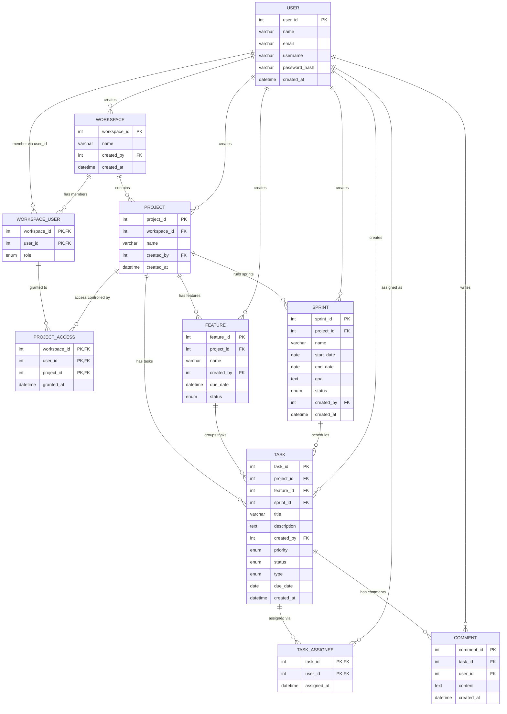

# Team Collaboration App — Database Schema

A Jira-like project management system. This document contains the entity overview,
the full MySQL DDL, the ER diagram source, and the key design decisions (with the
reasoning you can use to defend them).

---

## 1. Entities at a glance

| Entity | Purpose | Notes |
|---|---|---|
| `USER` | People in the system | |
| `WORKSPACE` | Top-level container, owned by a user | |
| `WORKSPACE_USER` | Junction: which users belong to which workspace | Holds `role` |
| `PROJECT` | A project inside a workspace | |
| `PROJECT_ACCESS` | Junction: per-user access to a project | |
| `FEATURE` | A feature/epic grouping tasks within a project | |
| `SPRINT` | A time-boxed iteration within a project | |
| `TASK` | The unit of work | `sprint_id` NULL = backlog |
| `TASK_ASSIGNEE` | Junction: many users can be assigned to a task | |
| `COMMENT` | Comments written on a task | |

---

## 2. MySQL DDL

> The `ENUM` value lists below are illustrative — adjust to your final wording.
> Tables are created in dependency order so every foreign key resolves.

```sql
-- 1. USER
CREATE TABLE user (
    user_id        INT AUTO_INCREMENT PRIMARY KEY,
    name           VARCHAR(100)  NOT NULL,
    email          VARCHAR(255)  NOT NULL UNIQUE,
    username       VARCHAR(50)   NOT NULL UNIQUE,
    password_hash  VARCHAR(255)  NOT NULL,
    created_at     DATETIME      NOT NULL DEFAULT CURRENT_TIMESTAMP
);

-- 2. WORKSPACE
CREATE TABLE workspace (
    workspace_id   INT AUTO_INCREMENT PRIMARY KEY,
    name           VARCHAR(100)  NOT NULL,
    created_by     INT           NOT NULL,
    created_at     DATETIME      NOT NULL DEFAULT CURRENT_TIMESTAMP,
    FOREIGN KEY (created_by) REFERENCES user(user_id)
);

-- 3. WORKSPACE_USER  (junction: many-to-many user <-> workspace)
CREATE TABLE workspace_user (
    workspace_id   INT NOT NULL,
    user_id        INT NOT NULL,
    role           ENUM('admin','member','viewer') NOT NULL DEFAULT 'member',
    PRIMARY KEY (workspace_id, user_id),
    FOREIGN KEY (workspace_id) REFERENCES workspace(workspace_id),
    FOREIGN KEY (user_id)      REFERENCES user(user_id)
);

-- 4. PROJECT
CREATE TABLE project (
    project_id     INT AUTO_INCREMENT PRIMARY KEY,
    workspace_id   INT           NOT NULL,
    name           VARCHAR(100)  NOT NULL,
    created_by     INT           NOT NULL,
    created_at     DATETIME      NOT NULL DEFAULT CURRENT_TIMESTAMP,
    FOREIGN KEY (workspace_id) REFERENCES workspace(workspace_id),
    FOREIGN KEY (created_by)   REFERENCES user(user_id)
);

-- 5. PROJECT_ACCESS  (junction: per-user project access)
CREATE TABLE project_access (
    workspace_id   INT NOT NULL,
    user_id        INT NOT NULL,
    project_id     INT NOT NULL,
    granted_at     DATETIME NOT NULL DEFAULT CURRENT_TIMESTAMP,
    PRIMARY KEY (workspace_id, user_id, project_id),
    FOREIGN KEY (workspace_id) REFERENCES workspace(workspace_id),
    FOREIGN KEY (user_id)      REFERENCES user(user_id),
    FOREIGN KEY (project_id)   REFERENCES project(project_id)
);

-- 6. FEATURE
CREATE TABLE feature (
    feature_id     INT AUTO_INCREMENT PRIMARY KEY,
    project_id     INT           NOT NULL,
    name           VARCHAR(150)  NOT NULL,
    created_by     INT           NOT NULL,
    due_date       DATETIME      NULL,
    status         ENUM('planned','in_progress','done') NOT NULL DEFAULT 'planned',
    FOREIGN KEY (project_id) REFERENCES project(project_id),
    FOREIGN KEY (created_by) REFERENCES user(user_id)
);

-- 7. SPRINT
CREATE TABLE sprint (
    sprint_id      INT AUTO_INCREMENT PRIMARY KEY,
    project_id     INT           NOT NULL,
    name           VARCHAR(100)  NOT NULL,
    start_date     DATE          NULL,
    end_date       DATE          NULL,
    goal           TEXT          NULL,
    status         ENUM('planned','active','completed') NOT NULL DEFAULT 'planned',
    created_by     INT           NOT NULL,
    created_at     DATETIME      NOT NULL DEFAULT CURRENT_TIMESTAMP,
    FOREIGN KEY (project_id) REFERENCES project(project_id),
    FOREIGN KEY (created_by) REFERENCES user(user_id)
);

-- 8. TASK
--    sprint_id NULL  => task sits in the backlog
--    feature_id NULL => task not grouped under a feature
CREATE TABLE task (
    task_id        INT AUTO_INCREMENT PRIMARY KEY,
    project_id     INT           NOT NULL,
    feature_id     INT           NULL,
    sprint_id      INT           NULL,
    title          VARCHAR(255)  NOT NULL,
    description    TEXT          NULL,
    created_by     INT           NOT NULL,
    priority       ENUM('low','medium','high','critical') NOT NULL DEFAULT 'medium',
    status         ENUM('todo','in_progress','in_review','done') NOT NULL DEFAULT 'todo',
    type           ENUM('story','bug','task','epic') NOT NULL DEFAULT 'task',
    due_date       DATE          NULL,
    created_at     DATETIME      NOT NULL DEFAULT CURRENT_TIMESTAMP,
    FOREIGN KEY (project_id) REFERENCES project(project_id),
    FOREIGN KEY (feature_id) REFERENCES feature(feature_id),
    FOREIGN KEY (sprint_id)  REFERENCES sprint(sprint_id),
    FOREIGN KEY (created_by) REFERENCES user(user_id)
);

-- 9. TASK_ASSIGNEE  (junction: many-to-many task <-> user)
CREATE TABLE task_assignee (
    task_id        INT NOT NULL,
    user_id        INT NOT NULL,
    assigned_at    DATETIME NOT NULL DEFAULT CURRENT_TIMESTAMP,
    PRIMARY KEY (task_id, user_id),
    FOREIGN KEY (task_id) REFERENCES task(task_id),
    FOREIGN KEY (user_id) REFERENCES user(user_id)
);

-- 10. COMMENT
CREATE TABLE comment (
    comment_id     INT AUTO_INCREMENT PRIMARY KEY,
    task_id        INT       NOT NULL,
    user_id        INT       NOT NULL,
    content        TEXT      NOT NULL,
    created_at     DATETIME  NOT NULL DEFAULT CURRENT_TIMESTAMP,
    FOREIGN KEY (task_id) REFERENCES task(task_id),
    FOREIGN KEY (user_id) REFERENCES user(user_id)
);
```

---

## 3. The backlog query

The backlog is **not a table** — it is the set of project tasks not yet pulled into a sprint:

```sql
SELECT *
FROM   task
WHERE  project_id = ?      -- the project whose backlog you want
  AND  sprint_id IS NULL;  -- not yet scheduled into any sprint
```

Pulling tasks into a sprint is a simple update:

```sql
UPDATE task
SET    sprint_id = ?       -- the target sprint
WHERE  task_id IN (...);   -- the chosen backlog tasks
```

Moving a task back to the backlog: `SET sprint_id = NULL`.

---

## 4. ER diagram (Mermaid source)

Paste into any Mermaid renderer (e.g. mermaid.live) to regenerate the diagram.



---

## 5. Design decisions to defend in the viva

**Why no separate `BACKLOG` entity?**
A backlog isn't an entity, it's a *state*. A `BACKLOG` table would carry no
attributes of its own beyond a foreign key to project (a 1:1) — that's the signal
it belongs *on* the existing data, not in a new table. The task's `sprint_id`
already decides where a task lives, so storing the backlog separately would create
a second source of truth that has to agree with the first. The backlog is a derived
result, not stored data.
*When would it flip to an entity?* If a project needed multiple, named, independently
groomed backlogs — then "backlog" gains its own identity and earns a table.

**Why `WORKSPACE_USER` / `TASK_ASSIGNEE` as junction tables?**
Both are many-to-many. You can't store many references in one column, and repeated
columns (`workspace_id_1`, `workspace_id_2`, ...) hardcode a limit and waste space.
A junction table = one row per relationship: no limit, no wasted cells, and a natural
home for relationship-specific data (e.g. `role`, `assigned_at`).

**Why `type` and `role` as `ENUM` but `SPRINT` as an entity?**
`ENUM` fits a fixed, small, mutually-exclusive, single-value set with no data of its
own. `SPRINT` has real attributes (`start_date`, `end_date`, `goal`, `status`), so it
earns a table. Same principle, opposite conclusion.
*When would `type` flip to a lookup table?* If users could define custom types, or each
type needed metadata (a colour/icon) — then `TASK_TYPE(type_id, name, colour)` + FK.

**Why a direct `project_id` on `TASK` (redundant with feature/sprint)?**
It makes the backlog query trivial (`project_id = ? AND sprint_id IS NULL`, no joins)
and prevents orphaned tasks that have neither feature nor sprint. The tradeoff: the
app layer must keep `task.project_id` consistent with its feature's and sprint's
project. A deliberate, query-driven denormalisation.

**The one-line rule that ties it all together:**
*One value per row → column/ENUM. Many values per row → junction table.
Has its own attributes → entity. Derivable from existing data → don't store it.*
