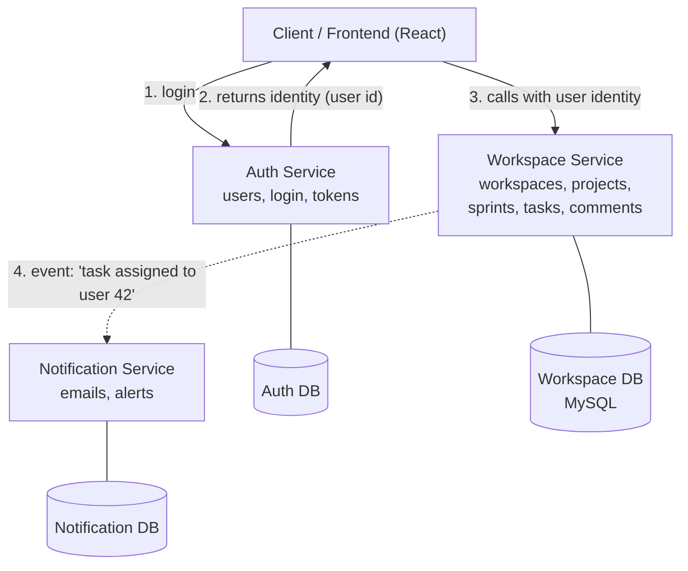
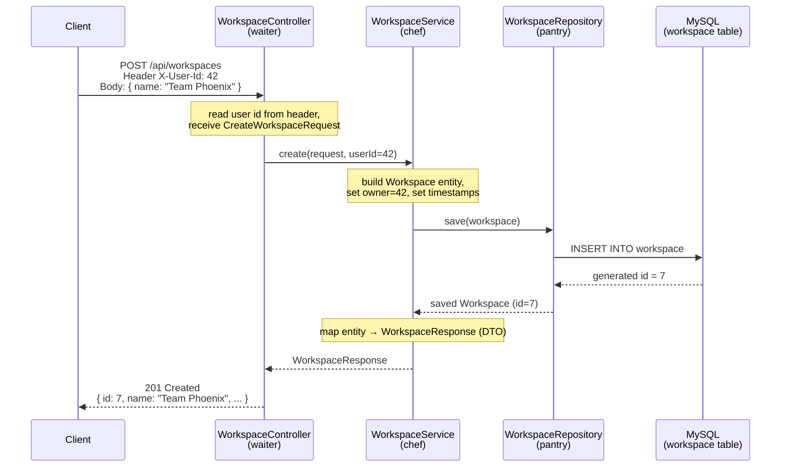
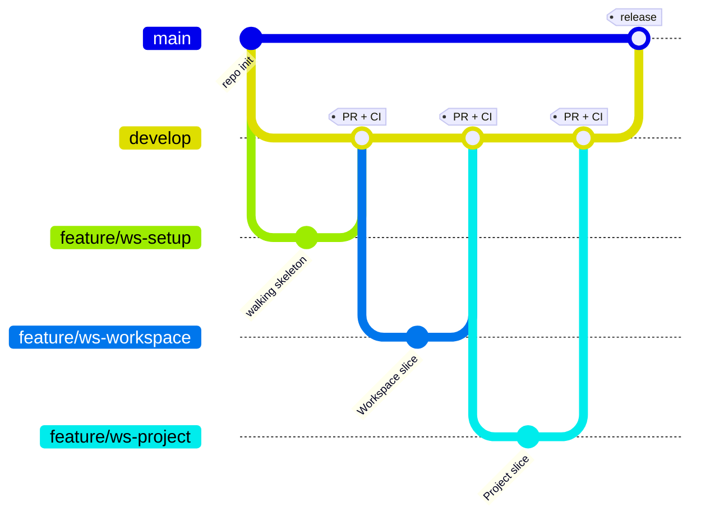
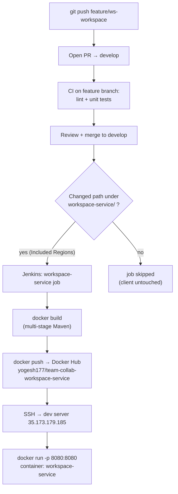

# Team Collaboration App — Architecture & Workflow Guide

> A single reference for how the project is structured, the order things get built,
> how a request flows through the code, and how one vertical slice travels from
> a `git push` to a running container. Written to be explained to a technical lead.

---

## 1. System Overview

The product is **three independent services**, each owning its **own database** and
talking to the others over the network. This is the *database-per-service* rule: no
service ever queries another service's database directly.



| Service | Owns | Port (dev) |
|---|---|---|
| **Auth Service** | People — registration, login, identity | 8081 |
| **Workspace Service** *(building now)* | The work — workspaces → projects → tasks | 8080 |
| **Notification Service** | Telling people things happened | 8082 |
| Client | UI | 80 |

**Interim auth:** Auth Service doesn't exist yet, so the Workspace Service trusts an
`X-User-Id` request header as a stand-in for the logged-in user. When Auth is real,
only that single extraction point changes — everything downstream stays the same.

---

## 2. Repository Structure (monorepo)

One Git repo, one top-level folder per deployable, each carrying its own pipeline files.

```
team-collab-app/
├── client/                      # React frontend (existing) — its own pipeline
│   ├── Dockerfile
│   ├── Jenkinsfile
│   ├── nginx.conf
│   └── .dockerignore
│
├── workspace-service/           # Spring Boot — modular monolith (building now)
│   ├── src/main/java/com/example/workspaceservice/
│   │   ├── WorkspaceServiceApplication.java
│   │   ├── common/                      # cross-cutting concerns
│   │   │   ├── config/
│   │   │   │   └── MapperConfig.java     # single shared ModelMapper bean
│   │   │   └── exception/                # global error handling
│   │   ├── workspace/                    # ← vertical slice (one feature)
│   │   ├── project/
│   │   ├── feature/
│   │   ├── sprint/
│   │   ├── task/
│   │   └── comment/
│   ├── src/main/resources/
│   │   └── application.properties
│   ├── src/test/java/...
│   ├── pom.xml
│   ├── mvnw / mvnw.cmd
│   ├── Dockerfile
│   ├── .dockerignore
│   └── Jenkinsfile
│
├── auth-service/                # later — same shape
├── notification-service/        # later — same shape
│
├── docs/                        # schema.md, ER diagram, user-flow, this guide
└── README.md
```

### A single slice, expanded

Top level is split **by feature**; underneath, **by layer**. This keeps each module's
boundary a folder, while still separating responsibilities inside it.

```
workspace/
├── controller/
│   └── WorkspaceController.java      # REST endpoints; reads the X-User-Id header
├── service/
│   ├── WorkspaceService.java         # business logic, @Transactional
│   └── WorkspaceUserService.java     # membership (junction lives in its parent slice)
├── repository/
│   ├── WorkspaceRepository.java      # extends JpaRepository<Workspace, Long>
│   └── WorkspaceUserRepository.java
├── entity/
│   ├── Workspace.java                # @Entity → workspace table
│   └── WorkspaceUser.java            # composite key (see soft-reference note below)
└── dto/
    ├── CreateWorkspaceRequest.java
    ├── UpdateWorkspaceRequest.java
    └── WorkspaceResponse.java
```

---

## 3. Inside the Workspace Service

### Why it's a *modular monolith* (one deployable, one DB, internal modules)

Guiding rule: **split where coupling is low and reasons-to-change differ; keep together
where coupling is high.** A task cannot exist without its project, sprint, and workspace —
they share foreign keys, are queried together, and change together. That is *high*
coupling, so splitting them into separate services would add network and distributed-
transaction cost for no benefit. Auth and Notification, by contrast, have low coupling
to the work domain and change for entirely different reasons, so they earn their own
services. Same principle, opposite answers.

### The layers (and what each one does)

| Layer | Job | Restaurant analogy |
|---|---|---|
| **Controller** | HTTP in/out; reads `X-User-Id`; maps DTOs | Waiter — takes the order, brings the plate |
| **Service** | Business logic, transactions | Chef — does the actual cooking |
| **Repository** | Data access (Spring Data JPA) | Pantry — fetches/stores ingredients |
| **Entity / DTO + Mapper** | DB shape vs. API shape | Plating — what the customer sees vs. the kitchen |

A request travels **down** the layers and the result comes back **up**, getting
translated from entity to DTO on the way out — so the database shape is never exposed
to the outside world.

### Junction entities & soft references

`WorkspaceUser` (workspace membership) lives **inside** the `workspace` slice, because its
lifecycle is governed by the workspace — it's born when a member is added and dies with
the workspace. It is a *sub-part* of an existing slice, not a slice of its own. The same
logic puts `ProjectAccess` inside the `project` slice.

`WorkspaceUser` has a composite key `(workspace_id, user_id)` — but only **one** of those
is a real foreign key:

- `workspace_id` → `workspace.id` — both live in the Workspace DB, so this is a **real,
  enforced FK** and is mapped in JPA as a `@ManyToOne` relationship.
- `user_id` → the `users` table, which lives in the **Auth DB**. A database cannot enforce
  a constraint against a table it can't see, so this is **not a foreign key** — it's a
  plain `Long userId` column (a *soft reference*), with **no** `@ManyToOne`.

**Rule of thumb:** if a field is a JPA relationship, this service owns that data; if it's
a bare `Long` id, the data is owned by another service. Consequences of the soft reference:
no cross-service SQL joins (enrich user details by calling Auth), and referential integrity
is the application's job, not the database's (handle deleted users via events or tolerate
orphans).

---

## 4. Development Order

### Step 0 — the walking skeleton (`feature/ws-setup`)

The **first** branch builds a *deployable but featureless* service: project scaffold,
`pom.xml`, DB wiring, `MapperConfig`, empty package structure, and the pipeline files —
**no domain code**. Success = the empty Swagger UI page loads.

Why it's its own branch:
1. **Prerequisite, not a feature** — you can't write an entity before the project exists.
2. **Different reasons to change** — infrastructure evolves separately from domain logic,
   so it gets its own clean, reviewable PR.
3. **Proves the pipeline in isolation** — merging it exercises the *entire* CI/CD path
   (build → push → deploy) with zero feature code in the way, so any later pipeline
   failure is unambiguously an infra problem, not your logic.

This is the established **"walking skeleton"** pattern (Cockburn; Freeman & Pryce,
*Growing Object-Oriented Software, Guided by Tests*): a thin end-to-end implementation
that links the architecture together before real functionality exists.

### Then — build slices in foreign-key order

Each entity depends on its parent existing first, so construction order follows the FK chain.
Junction entities fold into their parent slice's branch by default.

```
Workspace → WorkspaceUser → Project → ProjectAccess → Feature → Sprint → Task → TaskAssignee → Comment
```

Branch sequence (sequential, **not** parallel — each cut from the freshly-merged `develop`):

| # | Branch | Builds |
|---|---|---|
| 0 | `feature/ws-setup` | Walking skeleton + pipeline |
| 1 | `feature/ws-workspace` | `Workspace` + `WorkspaceUser` |
| 2 | `feature/ws-project` | `Project` + `ProjectAccess` |
| 3 | `feature/ws-feature` | `Feature` |
| 4 | `feature/ws-sprint` | `Sprint` |
| 5 | `feature/ws-task` | `Task` + `TaskAssignee` |
| 6 | `feature/ws-comment` | `Comment` |

The `ws-` prefix marks the service; later services use `auth-` / `notif-` so a glance at the
branch name tells you (and your reviewer) which service it touches.

---

## 5. Development Flow (per slice)

Each slice is a complete **vertical slice** — built end to end before the next one starts:

`entity` → `repository` → `service` → `controller` → `dto` → test via Swagger / `.http` files.

```bash
# 1. Start from the latest integration branch
git checkout develop
git pull origin develop

# 2. Cut the slice's feature branch
git checkout -b feature/ws-workspace

# 3. Build the vertical slice, committing in Conventional Commits style
#    feat: add Workspace entity and repository
#    feat: add create and list workspace endpoints

# 4. Verify locally (MySQL running) at http://localhost:8080/swagger-ui.html

# 5. Push and open a PR → develop
git push -u origin feature/ws-workspace
```

When the PR merges into `develop`, the path-scoped Jenkins job builds and deploys it to dev.

---

## 6. Request Flow

A single endpoint — *create a workspace* — through all four layers:



The same shape scales outward: a `ProjectService` calling into the `workspace` module is a
direct in-process method call; the Workspace Service notifying the Notification Service is
the same flow, except it crosses the network instead of staying in-process.

---

## 7. Git & Branching Strategy

GitFlow: two long-lived branches (`main` = production, `develop` = integration) and
short-lived `feature/*` branches. One vertical slice = one feature branch = one focused PR.



Conventions:
- **Branch names:** `feature/ws-<slice>` (e.g. `feature/ws-workspace`); `chore/<task>` for
  non-feature work (e.g. `chore/remove-api-contracts`).
- **Commits:** Conventional Commits — `feat:`, `fix:`, `chore:`, `docs:`.
- **PR target:** always `develop`, never `main` directly.
- **Cleanup:** merge a branch's work *before* deleting it; never delete a branch with
  unmerged commits (`git branch -d` refuses to, which is the safety net).

---

## 8. CI/CD — Complete Setup for One Slice

Each service has **one** Jenkins job pointed at **its own** `Jenkinsfile`, triggered only by
changes under its own path. The full journey from commit to running container:



### `workspace-service/Dockerfile` (multi-stage Maven build)

```dockerfile
# Stage 1 — build the jar with Maven
FROM maven:3.9-eclipse-temurin-21 AS builder
WORKDIR /app
COPY pom.xml .
RUN mvn dependency:go-offline -B          # cache deps as their own layer
COPY src ./src
RUN mvn clean package -DskipTests -B

# Stage 2 — run on a slim JRE  (the 21 must match pom.xml's java.version)
FROM eclipse-temurin:21-jre-alpine
WORKDIR /app
COPY --from=builder /app/target/*.jar app.jar
EXPOSE 8080
ENTRYPOINT ["java", "-jar", "app.jar"]
```

### `workspace-service/.dockerignore`

```
target/
.git/
.idea/
*.iml
```

### `workspace-service/Jenkinsfile`

```groovy
pipeline {
    agent any

    environment {
        IMAGE_NAME = "yogesh177/team-collab-workspace-service"
        IMAGE_TAG  = "${BUILD_NUMBER}"
        DEV_SERVER = "35.173.179.185"
        DEV_USER   = "ubuntu"
    }

    stages {
        stage('Checkout') {
            steps { checkout scm }
        }

        stage('Build Docker Image') {
            steps {
                dir('workspace-service') {            // only build this service's folder
                    sh """
                    docker build \
                      -t ${IMAGE_NAME}:${IMAGE_TAG} \
                      -t ${IMAGE_NAME}:develop-latest .
                    """
                }
            }
        }

        stage('Docker Login') {
            steps {
                withCredentials([usernamePassword(
                    credentialsId: 'dockerhub-creds',          // reuse existing creds
                    usernameVariable: 'DOCKER_USER',
                    passwordVariable: 'DOCKER_PASS')]) {
                    sh '''
                    echo "$DOCKER_PASS" | docker login -u "$DOCKER_USER" --password-stdin
                    '''
                }
            }
        }

        stage('Push Image') {
            steps {
                sh """
                docker push ${IMAGE_NAME}:${IMAGE_TAG}
                docker push ${IMAGE_NAME}:develop-latest
                """
            }
        }

        stage('Deploy To Dev') {
            when { branch 'develop' }
            steps {
                sshagent(['dev-server-key']) {                 // reuse existing SSH key
                    sh """
                    ssh -o StrictHostKeyChecking=no ${DEV_USER}@${DEV_SERVER} '
                        docker pull ${IMAGE_NAME}:develop-latest
                        docker stop workspace-service || true
                        docker rm workspace-service || true
                        docker run -d \
                            --name workspace-service \
                            --network team-collab-net \
                            -p 8080:8080 \
                            -e SPRING_DATASOURCE_URL=jdbc:mysql://mysql:3306/workspace_db \
                            -e SPRING_DATASOURCE_USERNAME=workspace \
                            ${IMAGE_NAME}:develop-latest
                    '
                    """
                }
            }
        }
    }

    post {
        always { sh 'docker logout || true' }
    }
}
```

> **Secrets:** never hardcode the DB password in the Jenkinsfile. Wrap it in
> `withCredentials` exactly like the Docker login and inject it as an env var.

### `application.properties` (local dev)

```properties
spring.application.name=workspace-service
server.port=8080

spring.datasource.url=jdbc:mysql://localhost:3306/workspace_db?createDatabaseIfNotExist=true
spring.datasource.username=root
spring.datasource.password=YOUR_LOCAL_PASSWORD

spring.jpa.hibernate.ddl-auto=update      # dev convenience; use validate + Flyway in prod
spring.jpa.show-sql=true
spring.jpa.properties.hibernate.format_sql=true

springdoc.swagger-ui.path=/swagger-ui.html
```

### Wiring the Jenkins job (one-time, per service)

1. **New Item → Pipeline.**
2. **Definition:** Pipeline script from SCM → Git → repo URL.
3. **Script Path:** `workspace-service/Jenkinsfile` *(this is what makes one repo support
   many pipelines — each job reads a different Jenkinsfile).*
4. **Git → Additional Behaviours → "Polling ignores commits in certain paths" →
   Included Regions:**
   ```
   workspace-service/.*
   ```
   This is the key line: the job only runs when files under its own path change. Add the
   matching `client/.*` to the existing client job so a backend push never rebuilds the
   frontend. Repeat per service (`auth-service/.*`, `notification-service/.*`).

Credentials (`dockerhub-creds`, `dev-server-key`) are account-wide and reused across all jobs.

---

## 9. Key Decisions & Rationale (interview-defensible)

| Decision | Choice | Why |
|---|---|---|
| Overall architecture | Microservices (Auth, Workspace, Notification) | Independent deploy + DB-per-service |
| Workspace internal design | Modular monolith | Modules are tightly coupled by FKs and change together |
| Database | MySQL | Engineering fit balanced against interview surface area |
| Cross-service references | Soft reference (`Long userId`, no `@ManyToOne`) | FK constraints can't cross a database boundary |
| Interim auth | `X-User-Id` header stub | Clean seam; only one point changes when Auth is real |
| API docs | springdoc (`/swagger-ui.html`) | Generated from controllers → can't drift from code |
| Entity ⇄ DTO mapping | ModelMapper | Simple runtime config; no build step |
| Mapping config | `STRICT` + `isNotNull()` | Predictable exact-name mapping; partial updates merge instead of clobbering |
| First branch | Walking skeleton (`feature/ws-setup`) | Proves the whole pipeline before any feature exists |
| CI scoping | Git Included Regions per service | Only the changed service rebuilds in the monorepo |

---

## Appendix — Quick Command Reference

```bash
# Start a new slice
git checkout develop && git pull origin develop
git checkout -b feature/ws-<slice>

# Run + verify locally (from inside workspace-service/, MySQL running)
./mvnw spring-boot:run
# → http://localhost:8080/swagger-ui.html

# Ship it
git push -u origin feature/ws-<slice>     # then open PR → develop

# Safe branch cleanup (only after merge)
git push origin --delete feature/ws-<slice>
git branch -d feature/ws-<slice>          # lowercase -d refuses if unmerged
```
